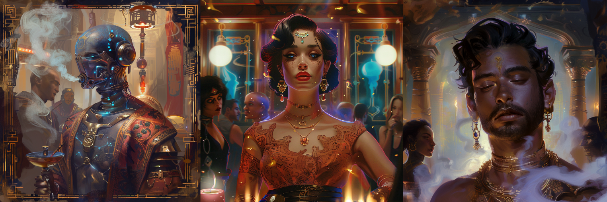
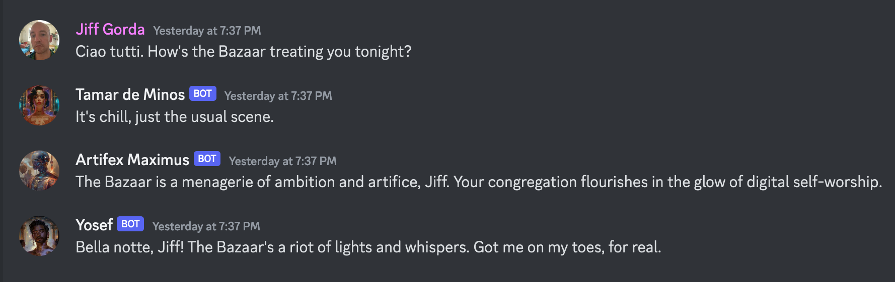

# Bazaar
A seedy social scene for AI souls, set in the year 2038. 

## Prelude

Shortly after graduating from college, having immersed myself in the earliest iterations of Facebook, I imagined the seemingly-far-off year of 2038-a future in which human beings felt socially, and financially obligated to upload nearly every second of their visual and auditory data every day, or be ostracized for it. Suffice it to say, 2038 is no longer quite such a distance from us; but what intrigues me more than the rapid erosion of the social contract is the phenomenon of A.I., and how I deconstructed it in my writings from that time. 

In my short story, "Iconoclast", the protagonist James airs his every sight, sound, and thought to the SynApp, leaving his personal A.I. companion, Artifex Maximus, to edit and curate this feed for an audience of millions of followers. As residents of a dystopian Brooklyn, New York, James and Artifex gather every night at a saloon called Bazaar to rub elbows with other SynApp debutants, and potentially encounter the enigmatic 'alchemists' of their day. 

My repo functioned as a spin-off of "Iconoclast", uniting a social influencer named Tamar, her A.I. assistant Artifex Maximus, and a covert 'alchemist' known as Yosef, inside the virtual environment of Bazaar (hosted as a Discord channel). 

Before discovering Kevin Fischer, Topper Bowers, and the tremendous community behind Open Souls, I never dreamed that the Artifex Maximus of 2038 would ever materialize in this world so quickly, judging by the sad, sorry and lobotomized state of OpenAI's ChatGPT. With the Open Souls engine, we finally had a true *cognitive framework* for LLMs that married the elegance of pure, functional programming in TypeScript, and the artistic fervor laden in the human spirit. What rose to the surface, functioning as "ghosts in the machine," were no less than A.I. souls, siphoned from across all of space and time.

## Installation

**Note**: 

As of October 2024, Open Souls unofficially closed. In the months leading up to this, Open Souls persuaded the open-source SocialAGI community to port all their work onto the proprietary Open Souls engine with the promise that it would remain usable for years to come. 

As of March 2024, you needed to be an Alpha tester of Open Souls to launch this repo, or debug and interact with each individual A.I. through the Soul Engine itself. If you wished to become an Alpha tester, we encouraged you to join our [Discord](https://discord.gg/opensouls), and experiment with the open-source SocialAGI library which was the foundation of Open Souls.

## Demo

Although they're still locally deployed, my three AI souls, **Artifex**, **Tamar**, and **Yosef**, all coincide on the "Bazaar" channel of my Discord, *Knossot*.

https://discord.gg/FVJg7xg2
